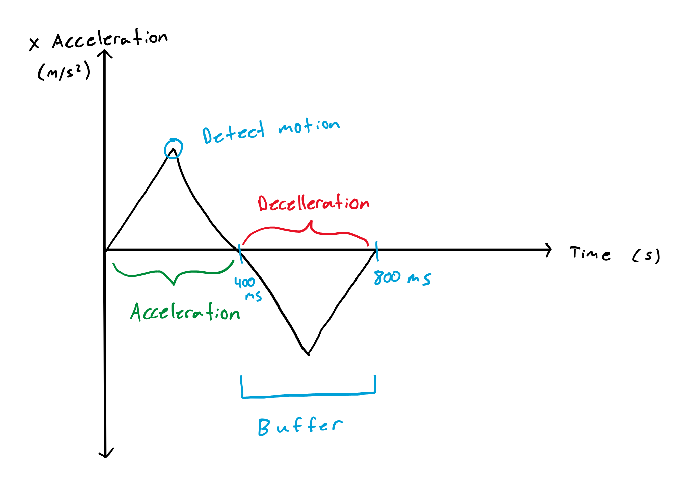
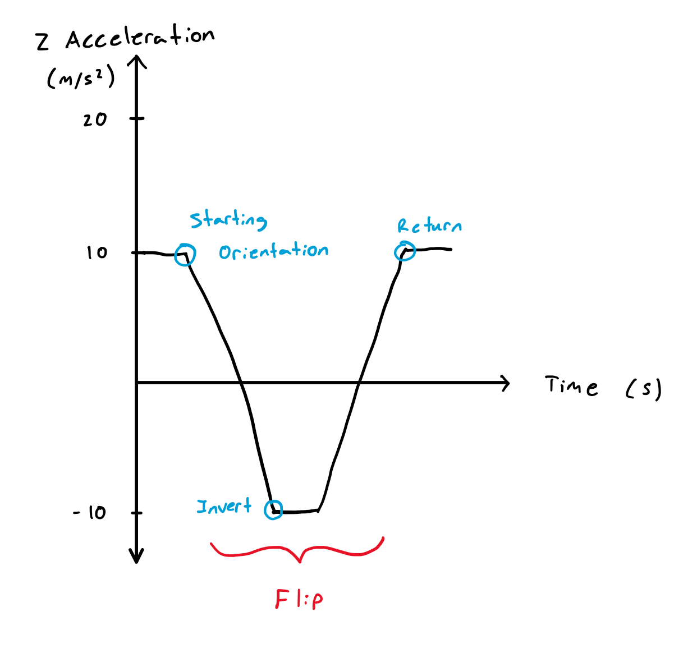
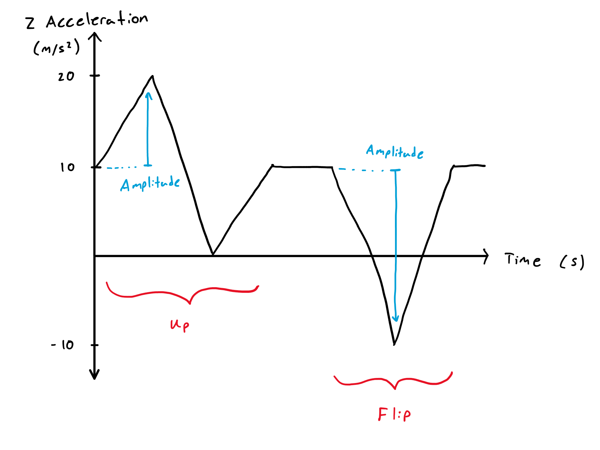
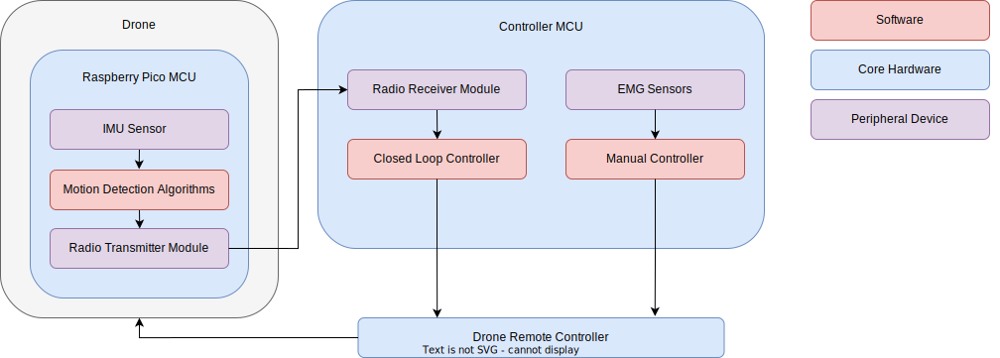

# Drone Motion Detector

A spike detection and recording system using an Adafruit LSM6DS33 interntial measurement unit connected to a Raspberry Pico microcontroller running CircuitPython code for I2C communication, button interaction, status LEDs, and motion detection algorithms.

The microcontroller detects acceleration based motions that are performed by the Sharper Image Stunt Drone: up, down, left right, forward, back, flip.

- [Drone Motion Detector](#drone-motion-detector)
  - [Demo](#demo)
  - [Using the Device](#using-the-device)
  - [Motion Detection](#motion-detection)
    - [Data Sequence](#data-sequence)
    - [Detecting X/Y/Z Motion](#detecting-xyz-motion)
    - [Detecting Flips](#detecting-flips)
      - [Alternative Solution to Detect Flips](#alternative-solution-to-detect-flips)
    - [Sensor Decoupling](#sensor-decoupling)
      - [Original Solution: Precedence Filtering](#original-solution-precedence-filtering)
      - [Better Solution: Local Maxima + Precedence](#better-solution-local-maxima--precedence)
    - [Calibrating Sensor Constants](#calibrating-sensor-constants)
      - [Buffer](#buffer)
      - [Sensitivity](#sensitivity)
      - [Data Rate](#data-rate)
        - [Cause of Throughput Constraint](#cause-of-throughput-constraint)
        - [Solution to Faster Throughput](#solution-to-faster-throughput)
    - [Future Improvements](#future-improvements)
      - [Extendability of Motion Detection](#extendability-of-motion-detection)
      - [Modifiable Sensor Calibration Code](#modifiable-sensor-calibration-code)
      - [Finding the Memory Overflow Point](#finding-the-memory-overflow-point)
      - [Use External Libraries](#use-external-libraries)
      - [Improved Sensor Calibration](#improved-sensor-calibration)
- [Drone Integration](#drone-integration)
  - [EMG Sensor Integration](#emg-sensor-integration)
    - [Sensor Pad Placement](#sensor-pad-placement)
  - [Drone Controller Rework](#drone-controller-rework)
- [Appendix](#appendix)
  - [Drone Axes](#drone-axes)
  - [MCU RAM Memory](#mcu-ram-memory)
  - [MCU Memory Segments](#mcu-memory-segments)


## Demo

The video shows 3 motion sequences that are correctly identified on the console output.

https://github.com/MatthewChow03/drone-motion-detector/assets/74833839/c7c6986f-58ae-42ca-b383-463416b7fff2

## Using the Device

The motion detector acts as a standalone device for testing purposes. The microcontroller interfaces with  2 buttons and 3 LEDs:
- Start Button: start recording a sequence of movements
- Stop Button: stop recording, analyze the results, and output the detected motions
- Ready LED: no sequence is being recorded
- Recording LED: a sequence is being recorded
- Status LED: user configurable LED

As seen in the demo, the buttons are used to record motion sequences and verify that motions are detected accurately. This interface is used to test the motion detection module before integration with the drone. See [Drone Integration](#drone-integration) for more information.

## Motion Detection

How do acceleration spikes turn into meaningful data?

### Data Sequence 

The recorded sequence of IMU data is stored in a list of dictionaries where each key is an axis of the IMU and each value is a list of data points. These are acceleration data points in units of m/s^2.

```python
sequence = {
    "AX": [], "AY": [], "AZ": [],
    "GX": [], "GY": [], "GZ": [],
}
```

After a recording has started and stopped, ``check_sequence()`` is called to analyze the data.

### Detecting X/Y/Z Motion

A threshold based algorithm with a buffer to ignore acceleration feedback. There are 2 steps:
1. Detect when a data point is over the threshold
2. Add a buffer for the subsequent data points to ignore decelleration spikes

Think of the motion patterns of the drone in the video. Directional motion changes are indicated by a sharp acceleration followed by a decelleration. There are two spikes where the first represents the intended motion and the second is simply feedback.



### Detecting Flips

A flip is when the drone does a 360 degree roation about the pitch or roll axis.

Since the spike detection for flipping and x/y/z motion is running on the same sequence of data points, an algorithm agnostic of order must be implemented. An up-flip-down sequence must be just as recognizable as a flip-down-up sequence. This means that each type of motion needs some characteristic behavior that distinguishes it.

Flips are detected using the sign of the Z axis measurement which inverts twice.

The algorithm is 3 steps:
1. Check starting orientation
2. Detect transition to inverse orientation
3. Confirm return to original orientation



#### Alternative Solution to Detect Flips

The flip can also be determined by analyzing subsequent data points. Let's define two values. First, the difference between the lowest and highest point (crest to trough on a wave). Second, the difference between the starting position and the peak of the first spike (amplitude on a wave). Let's define the magnitude of the inverse feedback to be the ratio between those two values.

Motion in x/y/z has a ~2x inverse feedback. This is caused by decelleration. For example moving the drone upwards would show a Z axis reading from 9.8 m/s^2 to 19.8 m/s^2 to 0 m/s^2 to 9.8 m/s^2 where the inverse feedback magnitude is 10 m/s^2

In comparison, the flip motion has an inverse feedback of ~1x magnitude. This is not from decelleration but rather the Z axis sign flip. For example, a flip would show a Z axis reading from 9.8 m/s^2 to -9.8 m/s^2 to 9.8 m/s^2 where the inverse feedback magnitude is 20 m/s^2.

The following image shows an up motion followed by a flip spike.



### Sensor Decoupling

The algorithm for motion detection is comprised of 7 seperate functions to identify x/y/z in the positive and negative direction as well as flips.

These motions have some coupling due to the motion not being directly aligned with the axis of travel. Note that the sensors themselves do not have significant coupling.

For example, the flip motion is somewhat of a C shape and displays characteristics of x/y/z motion.

#### Original Solution: Precedence Filtering

To solve this issue, data is filtered based on a pre determined precedence. The precedence defines which type of motion is more likely in the case of multiple types of motion being identified for a single point of time. This precedence was determined based on experimentation with the different motions and outputs of the algorithm.

The precendence is in order of flip, up/down, left/right, forward/back.

For example, a list of pairs of time and motion patterns could be:

```python
[{0.2 : "UP"}, {0.2 : "FLIP"}, {0.9: "RIGHT"}, {1.7 : "DOWN"}, {1.7 : "LEFT"}]
```

And the precedence filter would output:

```python
[{0.2 : "FLIP"}, {0.9: "RIGHT"}, {1.7 : "DOWN"}]
```

#### Better Solution: Local Maxima + Precedence

Using solely a precedence filter turned out to be insufficient in multiple situations. For example, the experimentation of performing motions and analyzing the results was not a precise method decoupling data because the experimentation did not cover all motion patterns.

The updated solution is to select the local maxima in the case of mulitple motion patterns being detected at the same time.

The precedence filtering continues to be used for two purposes:
- Identifying the flip before any other motion pattern
- Breaking ties between multiple multiple sensors detecting equal magnitude motion
  - Note that there is currently no solution for consistently determining diagonal motion patterns as they would result in a tie breaker every time under the current algorithm

For example, consider the list of detected motions in the format time, motion type, spike magnitude:

```python
[ {0.2 : "UP", 20.0}, {0.2 : "FLIP", n/a}, {0.2: "BACK", -20.0}, 
 {0.9: "RIGHT", 10.0}, {0.9: "DOWN", -15.0}, {0.9: "BACK", -2.0}, 
 {1.7 : "FORWARD", -15.0}, {1.7 : "RIGHT", 15.0} ]
```

And the precedence filter would output:

```python
[{0.2 : "FLIP"}, {0.9: "DOWN"}, {1.7 : "RIGHT"}]
```

The first motion was selected becuase flip takes precedence. The second motion was selected based on local maxima. The third motion was selected based on precedence filter.

### Calibrating Sensor Constants

There are 3 main constants that were determined through data experimentation: buffer, sensitivity, and polling rate.

#### Buffer

After a motion spike, the algorithm ignores subsequent data points related to the decelleration. This is to filter the situation where high magnitude decelleration gets interpreted as a new motion.

This buffer region was determined based on the average time period of a motion spike. At 10 Hz polling rate, the average number of decelleration data points was 2. This meant that after detecting acceleration we could ignore the following two data points.


#### Sensitivity

Sensitivity is the threshold for defining what is considered a positive or negative spikes. Anything below the sensitivity would be noise or small movements.

The higher the sensitivity, the better the signal to noise ratio. The current constant is set to minimize the number of false positives at the cost of possibly missing some real motions. The tested accuracy is 95% detection with no false positives. This was tested by performing single axis motions of each motion type. This process was completed 3 times and the resulting accuracy represented the average.

The sensitivity for each x/y/z motion pattern can be defined individually. The sensitivity constants are currently set to the same value since testing is in a controlled environment with the standalone sensor device. 

During integration with the drone this is expected to change. Consider the up vs down motion. The drone can move much faster downwards than it can upwards and fine grain control over sensitivity would result in better signal to noise ratios for each motion pattern.

Also note that part of this sensitivity value is related to the choice of precedence filtering when decoupling multiple motion sensors detected at the same time point (see [Sensor Decoupling](#sensor-decoupling)).

#### Data Rate

The polling rate is 10 Hz. Anything on the magnitude of 1 Hz would alias the data since motion is much faster than a couple data points per second. The polling rate was not increased to the 100 Hz or 1 kHz magnitude due to memory constraints caused by design choices and hardware:

The chosen rate of 10 Hz would overflow the memory of the Raspberry Pico in under 60 seconds. At this point the stack and heap would crash into each other and cause the MCU to reset.

So 100 Hz and above would not be suitable for recording enough data points to be analyzed as they would only be capable of recording less than 6 seconds of data. Even if a memory monitoring system was available, the size of the data sequence would not be large enough for testing purposes. ~6 seconds would only allow for up to 4 motions to be performed which would be inadequate for validating longer sequences and combinations.

##### Cause of Throughput Constraint

Good practices for embedded programming would disallow this behavior from the start. Ideally, no dynamic memory allocation would be allowed. It was apparent that this behavior would ensue since the MCU has 256 kB of RAM. ([Appendix: MCU RAM Memory](#mcu-ram-memory))

The following calculation explains why the MCU overflows in 60 seconds using a 10 Hz data rate.

The data structure storing the motion sequence is made of 6 lists of type float. This is 8 bytes * 6 lists * 10 entries per second = 3 kB of memory used. This would take 256/3 = 85 seconds to overflow the entire RAM.

However, 85 seconds is more than the 60 seconds seen in real world use of the device. This is because the MCU RAM is only 50%-90% usable for variables in the program. This explains the shorter times to reach an overflow. This lowered RAM utilization is because function call frames, local variables, and the system itself ([Appendix: MCU Memory Segments](#mcu-memory-segments)).

##### Solution to Faster Throughput

One solution to this issue would be to process the data with multithreading. This solution would allow the RAM utilization of be constraint by making the memory allocation static. The max memory usage would be the size of a queue. 

This queue would be used to buffer data as an inter task communication method. The queue length would be determined based on the polling rate and speed of the processing thread. For example, a slow motion detection algorithm and fast polling rate would require a larger queue since the queue would be flushed at a slower rate than data comes in.

This solution would be used for polling rates in the 100 Hz and higher magnitudes. 

The current solution is sufficient for the purposes of testing the motion detection algorithms for short and long sequences. The overhead of setting up multithreading on the Raspberry Pico was not worth the development time for the current application.

### Future Improvements

#### Extendability of Motion Detection

The current algorithm uses a precedence filter that differentiates flips and x/y/z motion. This works well because it catches all the current motion patterns. What if more types of motion or variations of motion were added to the detection algorithm?

If something like diagonal motion needed to be detected, the current solution may require a complete rework. This is because the algorithms for motion detection are based on high level characteristics of motion patters, not detailed characteristics. For example, a flip is easily determined by checking that the sign in subsequent data points inverts. But if other motion patterns include sign flipping then the code would break.

The solution would be to more strongly define the characteristics of each motion pattern and rework the algorithm from there. The current solution uses a buffer to ignore decelleration. However, that could be important data to distinguish motion patterns with more precision.

#### Modifiable Sensor Calibration Code

The current solution uses hardcoded calibration constants that are dependent on the polling rate of the algorithm. What if the polling rate changed? That would break the buffer feature and the constants used for parsing data structures. What if the sensor model changed? Then the threshold constants would need to be changed to new fixed values.

This means that changing the sensors or use conditions would require modification of the application level code. A better solution would be to add an additional layer to the code that separated hardware and software. That layer would parameterize things like sensor model and spike threshold rather than using constants throughout the application code.

This was not necessary for the project, but considering it wouldn't take much more effort, the up front cost would have been worth it. The main benefit would be more modifiable code and less time spent refactoring in the future.

#### Finding the Memory Overflow Point

Currently, the time before overflowing the MCU RAM was determined by running the program until it broke. What if we wanted to calculate when the memory would overflow instead? The solution would be to use a debugger to determine see the stack pointer and check how much of the RAM was being used up. From there, the remaining RAM and data rate would be enough to find the time before overflow. Information on MCU memory region usage may also be available with build tools.

Using a more accurate method of determining overflow makes the solution more reliable by getting a more precise time value. It is also an easily repeatable solution. What if the system overflowed after 5 days? That would go unnoticed or it would take a lot of effort to find.


#### Use External Libraries

Consider using more Python libraries for the algorithm portion of the code. This was not explored.

#### Improved Sensor Calibration

Learn more about sensor calibration and how the process actually works. My solution was something I came up with on my own to solve the problem. It would be beneficial to read some research about the domain.

# Drone Integration

This is a video of the Sharper Image Stunt Drone controlled by the consumer remote that it comes with.

https://github.com/MatthewChow03/drone-motion-detector/assets/74833839/24d19c9d-cb06-4ab9-9a1b-9d6c133dc371

The ongoing goal of this project is to integrate the motion detection algorithms with a biosensor controlled drone. Let's break that down:
- The drone's flight directions are controlled by the remote
- The drone's propellors are controlled by muscular activity
- The drone's axes (yaw, pitch, and roll) are stabilized by an attatched microcontroller
  - The microcontroller is running the motion detection algorithms to analyze the drone's movements
  - A radio transmitter sends the data from the drone to an external MCU
  - This external MCU transmits to the drone remote controller to form a closed loop system



## EMG Sensor Integration

Electromyography (EMG) signals are used to control the elevation of the drone. This is achieved by using the electrical response data to indicate upwards and downwards motions. 

This is a video showing the EMG sensor output when flexing a bicep.

https://github.com/MatthewChow03/drone-motion-detector/assets/74833839/641ad051-2f76-4bc6-b879-2b63d9851dc7

### Sensor Pad Placement

EMG works by measuring the change in electrochemical gradient

A signal (+), reference (+) and ground (-) pad is placed.
- Signal: place at the muscle belly where there are the most muscle fibres
- Reference: place next to the signal pad
- Ground: place away at a location with no muscular activity

Some EMG sensors work with a single positive and negative pad. The purpose of the reference pad in addition to the signal pad is to get a difference between the two and eliminate noise. Since the two positive sensors are next to each other, the values can be compared to reduce noise.

For example, the sensors will experience different voltage levels since they are at slightly different locations, however, common-mode noise such as electromagnetic interference will be constant. Algorithms and hardware from the manufacturer handles these calculations.

## Drone Controller Rework

The Sharper Image Stunt Drone uses two potentiometers to control the throttle/yaw and pitch/roll. Desoldering these potentiometers allows for the remote controller to be controlled via analog signals from a microcontroller. Make sure to replace the positive and negative terminals of the potentiometer with a 10k resistor. Then the middle signal pin will be controlled by a voltage from an Arduino microcontroller.

The analog EMG sensor data is translated to digital signals using the Adafruit board. This is converted back to an analog output by he Arduino to control what would have been the joystick. 

The Arduino microcontroller has no ability to output actual analog voltage. When using ``AnalogWrite()``, a pulse width modulation (PWM) signal is outputted which is a toggling of high and low voltage signals at a varied frequency. 

A low pass filter is used to convert this signal back to analog so that the drone controller PCB can understand the input. A 100 micro farad capacitor and 220 ohm resistor can be used. These values need more reasoning than just checking an oscilloscope.

# Appendix

A section for general notes and lessons.

## Drone Axes

The following diagram shows a plane to more clearly distinguish pitch and roll.


## MCU RAM Memory

Why do microcontrollers have such small RAM memory sizes? [Link](https://electronics.stackexchange.com/questions/134496/why-do-microcontrollers-have-so-little-ram)

## MCU Memory Segments

How does lower level system related data get stored on a microcontroller? [Link](https://electronics.stackexchange.com/questions/237740/what-resides-in-the-different-memory-types-of-a-microcontroller)